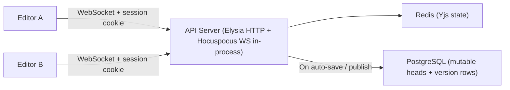

# SPEC-007 Editor, MDX, and Collaboration

This is the live canonical document under `docs/`.

## Editor & Post-MVP Real-Time Collaboration

### Editor Engine

The content editor is built on **TipTap**. MVP ships a single-user editor with Markdown/MDX serialization, draft autosave, and explicit publish/version-history flows. **Yjs/Hocuspocus-based multi-user collaboration is intentionally deferred to Post-MVP.**

> **TipTap & ProseMirror:** TipTap is a framework built on top of ProseMirror (the low-level editing engine by Marijn Haverbeke). TipTap provides the extension system, React integration, NodeViews, and developer-friendly APIs — but under the hood, every TipTap document is a ProseMirror document. When this spec refers to "ProseMirror document model," "node types," or "schema," it means TipTap's internal data structures inherited from ProseMirror. You interact with them through TipTap's API; direct ProseMirror imports are only needed for advanced custom extensions.

#### Markdown Serialization

Content is stored as Markdown/MDX text (`body` column) but edited via TipTap's internal document model. Bidirectional conversion between the two representations uses **`@tiptap/markdown`** (the official TipTap markdown extension, shipped in TipTap 3.7.0). It uses **Marked.js** as the parser/lexer and provides per-extension `markdown.parse` and `markdown.render` handlers.

**MDX component serialization** is handled by a custom layer on top of `@tiptap/markdown`:

1. A **custom Marked.js tokenizer** recognizes JSX block and inline syntax (`<ComponentName prop="value">...</ComponentName>`) during parsing and emits tokens for them.
2. A **custom TipTap extension** (`MdxComponent`) defines the node type with attrs (`componentName`, `props` as JSON) and provides the corresponding `markdown.parse` (token → node) and `markdown.render` (node → MDX string) handlers.
3. For wrapper components with `children`, the node uses a content hole that allows nested rich-text editing inside the component block.

This approach keeps MDX parsing/serialization within TipTap's standard extension model. If the custom Marked.js tokenizer proves insufficient for complex MDX (deeply nested components, JSX expressions in props), a fallback option is to swap the parsing layer to **remark + remark-mdx** (from the unified ecosystem) via `@handlewithcare/remark-prosemirror`, which provides a battle-tested MDX AST but is a smaller community project (~28 stars, from the NYT/moment.dev team).

**Round-trip idempotency requirement:** The serialization pipeline must satisfy `serialize(parse(markdown)) === markdown` for all content the schema produces. This prevents phantom diffs, where a cold-start load/save cycle produces byte-different but semantically identical content and causes unnecessary `draft_revision` churn. The CI suite must include round-trip fidelity tests for each schema type.

### Post-MVP Collaboration Architecture

The following subsection is a **future design target**, not an MVP transport contract.



Post-MVP design target:

- WebSocket endpoint: `/api/v1/collaboration`.
- Clients authenticate to WebSocket using the same Studio session (cookie-based) with strict `Origin` checking.
- Collaboration runs in the same Bun process as the API server via Hocuspocus + `ws` polyfill.
- Connection target is explicit via query params: `project`, `environment`, `documentId`.
- API keys are rejected for collaboration sockets.

#### Post-MVP Collaboration Authorization Flow

When the collaboration transport is implemented, WebSocket connect (`/api/v1/collaboration?project=...&environment=...&documentId=...`) must:

1. Validate `Origin` against the configured Studio allowlist (reject if mismatch).
2. Validate Studio session cookie with better-auth (reject unauthorized).
3. Validate explicit routing scope (`project`, `environment`) exists and is permitted for the authenticated user.
4. Load target `documentId` and assert it belongs to `(project, environment)`.
5. Evaluate folder/path RBAC for that document (`documents.path`) and require draft read/write access for collaboration.
6. Attach `{userId, sessionId, project, environment, documentId, role}` to the socket context.
7. On each write path (`onStoreDocument`, publish) re-check session validity; close socket (`4401`) if revoked/expired, or (`4403`) if permissions no longer allow access.

### State Management

**MVP source of truth hierarchy:** PostgreSQL `body` (markdown/MDX) is the canonical source of truth. The editor loads content from `documents.body`, maintains local TipTap state in the browser, and persists debounced draft saves back to PostgreSQL. Redis is not part of the MVP editor data path.

**MVP document load/save cycle:**

```
1. Load `body` from documents in PostgreSQL.
2. Parse markdown/MDX -> ProseMirror JSON in the editor.
3. On debounced save, serialize ProseMirror JSON -> markdown/MDX.
4. UPDATE documents SET body = $1, draft_revision = draft_revision + 1, has_unpublished_changes = TRUE.
```

**Post-MVP collaboration cache design:** When multi-user editing is reprioritized, Redis-backed Yjs state remains ephemeral and PostgreSQL remains canonical. The Yjs binary is never stored in PostgreSQL, and `onLoadDocument`/`onStoreDocument` must continue to rebuild from or flush back to canonical markdown/MDX text.

### Presence Awareness (Post-MVP)

Presence awareness is deferred to Post-MVP. When implemented, the server will track:

- Which users are online
- Which document each user is currently viewing or editing
- Cursor positions and selections within collaborative editing sessions

Presence indicators belong in the content list and editor only after the collaboration transport exists.

### Saving

There are two distinct save operations:

**Auto-save (draft):**

- Debounced: triggers ~5 seconds after the last change, or on editor blur/disconnect.
- Serializes the current TipTap document state to markdown together with the
  current frontmatter draft state from the schema-driven `Properties` tab.
- `UPDATE`s the `documents` row in place, sets `has_unpublished_changes = TRUE`, and increments `draft_revision`. No version history is created.
- Silent — no UI indication beyond a subtle "Saved" indicator.
- Does not depend on Redis, WebSocket sessions, or webhook fan-out in MVP.
- Frontmatter-only edits and body-only edits use the same draft-save pipeline
  and the same unsaved/saving/saved state machine.

**Publish (versioned):**

- Explicit user action (Publish button).
- The client invokes the publish endpoint with the document identity and the
  optional change summary; it does not upload the body/frontmatter snapshot as
  part of the publish request in MVP.
- The server copies the current mutable draft body and frontmatter from the
  `documents` head row into a new immutable row in `document_versions` at the
  moment publish succeeds.
- Optionally includes a change summary entered by the user.
- This is the only action that creates version history.

---

## MDX Component System

### Component Registration

Developers declare injectable MDX components in `mdcms.config.ts`:

```typescript
components: [
  {
    name: 'Chart',
    importPath: '@/components/mdx/Chart',
    load: () => import('@/components/mdx/Chart').then((m) => m.Chart),
    description: 'Renders a data chart with configurable options',
    // Optional: UI hints to override auto-detected form controls or mark string
    // props as URL-formatted for validation.
    propHints: {
      website: { format: 'url' },
      color: { widget: 'color-picker' },
    },
  },
  {
    name: 'Callout',
    importPath: '@/components/mdx/Callout',
    description: 'Styled callout box with type variants (info, warning, error)',
  },
  {
    name: 'PricingTable',
    importPath: '@/components/mdx/PricingTable',
    load: () => import('@/components/mdx/PricingTable').then((m) => m.PricingTable),
    description: 'Configurable pricing table with tiers',
    // For complex props: developer provides a custom editor component
    propsEditor: '@/components/mdx/PricingTable.editor',
    loadPropsEditor: () =>
      import('@/components/mdx/PricingTable.editor').then((m) => m.default),
  },
],
```

`importPath` and `propsEditor` remain config-owned authoring metadata for local
extraction workflows. `load` and `loadPropsEditor` are host-local executable
loader callbacks used by the embedded Studio shell/runtime path. They are not
serialized into the shared normalized config shape or sent to the backend.

The local MDX component catalog is derived from `config.components` and carried into the embedded Studio runtime by the host app:

```typescript
export type MdxComponentCatalogEntry = {
  name: string;
  importPath: string;
  description?: string;
  builtIn?: true;
  propHints?: Record<string, MdxPropHint>;
  propsEditor?: string;
  extractedProps?: MdxExtractedProps;
};

export type MdxSelectOptionValue = string | number | boolean;

export type MdxSelectOption =
  | MdxSelectOptionValue
  | { label: string; value: MdxSelectOptionValue };

export type MdxPropHint =
  | { format: "url" }
  | { widget: "color-picker" }
  | { widget: "textarea" }
  | { widget: "slider"; min: number; max: number; step?: number }
  | { widget: "image" }
  | { widget: "select"; options: MdxSelectOption[] }
  | { widget: "hidden" }
  | { widget: "json" };

export type MdxComponentCatalog = {
  components: MdxComponentCatalogEntry[];
};

export type MdcmsInlineStyle = Record<string, string | number>;

export type MdxExtractedProps = Record<string, MdxExtractedProp>;

export type MdxExtractedProp =
  | { type: "string"; required: boolean; format?: "url" }
  | { type: "number"; required: boolean }
  | { type: "boolean"; required: boolean }
  | { type: "date"; required: boolean }
  | { type: "enum"; required: boolean; values: string[] }
  | { type: "array"; required: boolean; items: "string" | "number" }
  | { type: "style"; required: boolean }
  | { type: "json"; required: boolean }
  | { type: "rich-text"; required: boolean };

export type MdxComponentHostCapabilities = {
  resolvePropsEditor: (name: string) => Promise<unknown | null>;
};
```

The host app owns the executable capabilities. The embedded Studio runtime consumes:

- `catalog.components[*].extractedProps` for auto-generated form controls and fallback editing behavior
- `catalog.components[*].propHints` for widget overrides
- `resolvePropsEditor(...)` for custom editor resolution when `propsEditor` is configured

Executable editor values remain opaque at the shared contract layer
(`Promise<unknown | null>` at the resolver boundary).
In practice these are host-local React components resolved inside the embedding app bundle.

`importPath` and `propsEditor` remain config-owned authoring metadata. They identify the source modules used by the local extraction/runtime pipeline, but runtime resolution is keyed by component `name` rather than by path strings carried over the Studio boundary.

URL intent is not a widget override. It is carried on extracted string props as
`format: "url"` and maps to a URL input with validation in the auto-generated
form contract.

#### Built-In MDX Components

MDCMS provides a small set of built-in MDX components for AI-authored and
manual MDX composition. These components are part of the local MDX catalog even
when the host app does not declare them in `mdcms.config.ts`:

- `Box` renders a `div` and accepts `style?: MdcmsInlineStyle` and `children`.
- `Text` renders a `span` and accepts `style?: MdcmsInlineStyle` and
  `children`.
- `Image` renders an `img` and accepts required `src`, required `alt`, and
  optional `style?: MdcmsInlineStyle`.
- `Link` renders an `a` and accepts required `href`, optional
  `style?: MdcmsInlineStyle`, and `children`.

Built-ins are catalog entries with `builtIn: true`. This flag is provenance and
Studio discoverability metadata only: parsing, serialization, preview
rendering, AI validation, and production rendering treat built-ins and
host-registered components through the same component-name and prop-schema
contracts.

Built-in names are reserved. Host config preparation must fail with a
deterministic error when `config.components` declares `Box`, `Text`, `Image`, or
`Link`. Host components can support inline styling only by exposing their own
`style` prop in the extracted catalog; built-in support does not imply a
universal wrapper or style injection layer for host components.

Raw lowercase MDX/HTML elements such as `<div>`, `<form>`, `<label>`,
`<input>`, and `<button>` remain valid advanced MDX authoring syntax. They are
not catalog components and are not shown as first-class visual composition
blocks. Studio preserves them as raw MDX islands, renders an inert preview where
possible, and serializes them back to their original MDX source. Built-ins are
therefore the supported visual-editing primitives, not the only HTML that can
exist in a document.

The legacy `/` slash menu lists only host-registered components and is
positioned inline near the active cursor. Built-ins remain hidden from that
legacy insertion surface, but manual MDX editing, AI proposals, and the
dedicated visual composition UI may use them. The editor toolbar's Insert
Component control opens and closes the docked visual composition palette rather
than rendering a second top-docked picker. The visual composition palette is
the first Studio-owned insertion surface that intentionally exposes built-ins.

Built-in React source lives in an internal private workspace package and is
bundled into published consumers. App authors do not install that workspace
package directly. Public application code may import built-ins from the SDK's
browser-safe React primitive subpath:

```typescript
import { Box, Text, Image, Link } from "@mdcms/sdk/react-primitives";
```

The embedded Studio runtime never performs TypeScript analysis in the browser.
When auto-generated props editing is needed, the host app prepares the local MDX
catalog on a Node-side integration path (for example a framework server
component, build hook, dev-server hook, or explicit local script) and then
passes the prepared serializable metadata into the client shell. Whether the
host caches or code-generates that prepared catalog is an integration detail;
the product contract is only that Studio receives `catalog.components[*].extractedProps`
as serializable local metadata and that the backend never owns this catalog.

### Auto Prop Extraction

A local Node-side preparation pipeline parses the TypeScript source files at the
specified `importPath` and automatically extracts supported prop type
definitions. MDCMS may expose this pipeline through CLI helpers and host-app
preparation helpers, but the extraction contract is the same across local
consumers. These prop types are stored in `catalog.components[*].extractedProps`,
consumed by the embedded Studio runtime, and displayed in the Studio UI when
inserting components.

Example: Given a component file:

```tsx
interface ChartProps {
  data: number[];
  type: 'bar' | 'line' | 'pie';
  title?: string;
  color?: string;
}

export function Chart({ data, type, title, color }: ChartProps) { ... }
```

The preparation pipeline extracts:

```json
{
  "name": "Chart",
  "props": {
    "data": { "type": "array", "items": "number", "required": true },
    "type": {
      "type": "enum",
      "values": ["bar", "line", "pie"],
      "required": true
    },
    "title": { "type": "string", "required": false },
    "color": { "type": "string", "required": false }
  }
}
```

Extraction is deterministic and fail-closed:

- A prop is included only when its declared TypeScript shape normalizes to one
  of the supported `MdxExtractedProp` variants above.
- `required` is derived from the declared prop type only:
  - `false` for `prop?: T` and `prop: T | undefined`
  - `true` otherwise
- The extractor does not evaluate runtime default expressions in component
  implementations.
- String-literal unions normalize to `type: 'enum'` with declaration-order
  `values`.
- Arrays normalize only when the item type is exactly `string` or `number`.
- A prop may normalize to `type: 'json'` only when the developer explicitly
  opts that prop into the `json` widget hint and the declared TypeScript shape
  is JSON-serializable.
- A prop may normalize to `type: 'style'` only when it is a React inline style
  object shape that can be represented as `MdcmsInlineStyle`.
- A string prop may additionally carry `format: 'url'` when `propHints.<propName>.format = 'url'`; this maps to a URL input with validation and is not a widget.
- `children` and props typed as `ReactNode` normalize to `type: 'rich-text'`.
- A prop is omitted from `extractedProps` when it cannot be normalized
  deterministically. Omitted props are hidden from the auto-generated CMS form
  unless a custom props editor handles them.

The following prop shapes are unsupported by default and are omitted from the
extracted schema:

- function and callback types
- refs and ref-like handles
- React elements/components other than `children` / `ReactNode`
- object, record, map, set, tuple, and class-instance shapes without an
  explicit `json` hint
- CSS rule objects, responsive style objects, pseudo-state styles, functions,
  arrays, and nested style values
- mixed or non-literal unions, intersections, unresolved generics, and arrays
  of unsupported item types
- any shape that is not JSON-serializable or cannot be normalized

These props can only be set in code unless a later override path explicitly
re-enables them.

### Prop Type → Form Control Mapping

Auto-detected prop types map to form controls as follows:

| Prop Type                                  | Form Control              | Notes                    |
| ------------------------------------------ | ------------------------- | ------------------------ |
| `string`                                   | Text input                |                          |
| `number`                                   | Number input              |                          |
| `boolean`                                  | Toggle / checkbox         |                          |
| `'a' \| 'b' \| 'c'` (string literal union) | Dropdown select           |                          |
| `string[]`                                 | Tag input                 | Add/remove string values |
| `number[]`                                 | Repeatable number input   | Add/remove number values |
| `Date`                                     | Date picker               |                          |
| `string` with `format: "url"`              | URL input with validation | Not a widget             |
| `MdcmsInlineStyle`                         | Style editor              | Flat inline style only   |
| `ReactNode` / `children`                   | Nested rich text editor   | See §18.5                |
| Function types                             | **Hidden**                | Not CMS-editable         |
| Ref types                                  | **Hidden**                | Not CMS-editable         |

### Widget Hints (Developer Overrides)

Developers can override the auto-detected form control by providing `propHints` in the component config. Available widgets:

| Widget         | Use Case                                                                                  |
| -------------- | ----------------------------------------------------------------------------------------- |
| `color-picker` | Color selection with visual picker                                                        |
| `textarea`     | Multi-line text (instead of single-line input)                                            |
| `slider`       | Number within a range: `{ widget: 'slider', min: 0, max: 100 }`                           |
| `image`        | Image upload/selection (integrates with media system)                                     |
| `select`       | Force dropdown for any type: `{ widget: 'select', options: [...] }`                       |
| `hidden`       | Explicitly hide a prop from the CMS form                                                  |
| `json`         | Raw JSON editor for a JSON-serializable prop shape explicitly opted into by the developer |

Auto-detection is the default. Hints override auto-detection. If a prop type is
too complex for auto-detection and no hint or custom editor is provided, the
prop is **hidden** from the CMS form (it can only be set in code). The `json`
hint does not make function, ref, or other non-serializable prop shapes
editable.

`propHints.<propName>.format = 'url'` is a string-format signal, not a widget
override. It is preserved in extracted props and used by the auto-control
mapping to render a URL input with validation.

Widget-hint precedence is deterministic:

1. If a component-level `propsEditor` resolves successfully, Studio renders
   that custom editor instead of per-prop auto-generated controls for that
   component.
2. Otherwise, for each extracted prop, a valid
   `propHints.<propName>.widget` override wins over the default prop-type
   mapping.
3. Otherwise, the default mapping in §18.4 applies.
4. If a prop cannot be normalized and no valid widget hint or custom editor
   covers it, that prop remains hidden.

Hint validation happens during local MDX catalog preparation. Invalid hint
shapes, malformed widget config, and incompatible widget/prop-type combinations
fail preparation instead of being silently ignored in the browser.

Widget validation rules:

- `format: 'url'` is a string-format signal, not a widget, and cannot be
  combined with `widget`.
- `color-picker`, `textarea`, and `image` are valid only for extracted
  `string` props.
- The `image` widget edits a string-valued image reference in the MDX props
  object.
- `slider` is valid only for extracted `number` props and requires finite
  `min` and `max` values with `min < max`; if `step` is provided it must be
  finite and greater than `0`.
- `select` requires a non-empty `options` list. Option values must be
  `string`, `number`, or `boolean`, and all option values must match the target
  prop's scalar kind.
- `hidden` is valid for any prop and suppresses that prop from the CMS form.
- `json` is valid only for JSON-serializable props and does not make function,
  ref, or other non-serializable shapes editable.
- `style` props do not support widget overrides in this phase. They remain
  flat inline style objects with string or number values.

### Custom Props Editors

For components with complex prop structures that can't be represented by auto-generated forms (e.g., a pricing table with nested tier objects, a data grid with column definitions), developers provide a **custom editor component**:

```typescript
// components/mdx/PricingTable.editor.tsx
import type { PropsEditorComponent } from '@mdcms/studio';

const PricingTableEditor: PropsEditorComponent<PricingTableProps> = ({
  value,    // Current prop values
  onChange, // Callback to update props
}) => {
  return (
    <div>
      {value.tiers.map((tier, i) => (
        <div key={i}>
          <input
            value={tier.name}
            onChange={(e) => {
              const newTiers = [...value.tiers];
              newTiers[i] = { ...tier, name: e.target.value };
              onChange({ ...value, tiers: newTiers });
            }}
          />
          {/* ... more fields */}
        </div>
      ))}
    </div>
  );
};

export default PricingTableEditor;
```

When `propsEditor` is specified in the component config, the embedded Studio
runtime resolves that editor lazily through `resolvePropsEditor(componentName)`
when the props panel is opened or first needed. If resolution returns `null`,
the runtime falls back to the auto-generated form controls derived from
`catalog.components[*].extractedProps`.

The custom editor receives:

- `value`: the current JSON-serializable props object for the component node;
  this value may be partial during initial insertion
- `onChange(nextValue)`: replaces the current props object in local document
  state and participates in the same autosave/persistence flow as other draft
  edits
- `readOnly`: `true` when the current session may inspect props but may not
  modify them

If a component has **no** `propsEditor` and some of its props are too complex for auto-generation, those specific props are hidden. Simple props are still auto-generated.

### Custom Props Editor Lifecycle

The custom props editor host supports these states:

- `loading`: `resolvePropsEditor(componentName)` is pending; the props panel
  shows a non-interactive loading state.
- `ready`: resolution succeeds with an executable editor component; the runtime
  mounts it and passes `value`, `onChange`, and `readOnly`.
- `content-only`: no top-level prop controls are available, but the component
  exposes nested rich-text `children`; the props panel points the author to the
  wrapper block's inline content area instead of implying the component is not
  editable.
- `empty`: resolution returns `null` and no fallback auto-generated controls
  are available, and the component has no nested rich-text editing surface; the
  props panel shows that the component has no editable props.
- `error`: resolution rejects, or the resolved editor fails during initial
  render; the props panel shows an error state and does not silently switch to
  a different editor mode.
- `forbidden`: the current session cannot edit component props; the props panel
  shows editing is unavailable, and `onChange` must not mutate document state
  while `readOnly` is `true`.

### Children / Nested Content

Components that accept `children` (content between opening and closing tags) are treated specially:

```mdx
<Callout tone="warning">
  This is **important** markdown content inside the component.
</Callout>
```

MDX children are nested document content. Markdown block syntax and nested MDX
components are valid inside wrapper component children when written as normal
MDX:

```mdx
<Box style={{"padding":"24px"}}>
  ## Heading

  <Text style={{"fontWeight":600}}>
    [Styled link](/pricing)
  </Text>
</Box>
```

In the current editor, the children area is a nested TipTap rich text surface
within the component's node view. This means content editors can use full
markdown formatting (bold, links, lists, etc.) inside component blocks.
Dedicated visual composition controls can insert, move, wrap, unwrap,
duplicate, delete, and style valid child nodes inside compatible wrapper
components. AI proposals and manual MDX editing use the same persisted MDX
shape and the same validation rules.

When wrapper children contain raw lowercase MDX/HTML, Studio keeps that raw
subtree as a selectable, non-inline-editable island inside the child surface.
The island may be deleted, moved, or replaced as a block, but its internal HTML
is edited through Markdown/MDX source editing rather than through the visual
component controls. This preserves parity with SDK/public rendering without
turning arbitrary HTML into Studio-owned components.

Wrapper component chrome and the props panel must make this distinction clear:
top-level props remain in the side panel, while nested markdown content is
edited directly inside the component block in the canvas.

### Visual Composition UI

Studio provides a desktop visual composition surface for MDX documents. It is a
document-flow builder layered over the TipTap document model, not a freeform
absolute-positioning canvas. Drag/drop changes the normal Markdown/MDX document
tree order and never persists layout coordinates.

The visual composition surface has three regions:

1. A collapsible left block palette on desktop, hidden by default and toggled
   by the editor toolbar's Insert Component control.
2. The central editor canvas with selection chrome, drag handles, contextual
   drop targets, and host-rendered component previews where available.
3. The selected-block inspector in the document sidebar.

The palette exposes atomic blocks/components only:

- Text: paragraph, heading, list, quote.
- Layout: `Box`.
- Media: `Image`.
- Actions: `Link`.
- Components: host-registered MDX components.

The palette may expose search/filtering by block name, description, and
category. It uses editor-facing categories; provenance such as Markdown,
built-in, or host component is secondary metadata. Saved compositions,
templates, named slots, responsive variants, touch drag/drop, and keyboard
reorder/nesting parity are deferred.

All document blocks participate in document-flow drag/drop:

- markdown headings
- paragraphs
- lists
- blockquotes
- MDX component blocks
- built-in MDX components
- host-registered MDX components

Visible drop targets are always valid. Studio must not render invalid parent,
child, or sibling drop targets. Before/after drop targets appear for valid
sibling positions. Inside drop targets appear only for wrapper components that
expose `children` as a `rich-text` prop. Any wrapper component with rich-text
`children` can receive child drops; this is not limited to `Box`. V1 supports
only the default `children` zone. Host wrapper components receive one default
child-drop overlay over the component body/children area; hosts do not need to
map exact internal DOM slots.

`Text` and `Link` are inline editing surfaces. They accept text and inline
formatting edits but must not expose structural block drop targets for
headings, lists, boxes, images, or other block-level content.

Normal editing flows should avoid creating invalid nodes. Dragging a palette
block with required props opens an insertion configuration surface before
committing the node. The node is inserted only after required props are valid.
Canceling leaves the document unchanged. Blocks/components with safe defaults
insert immediately. If a component provides a custom props editor, the
insertion surface uses that editor; otherwise it uses the generated prop form
from catalog metadata.

Selected blocks expose contextual chrome. Single click selects a block and
double click edits text/content inside it. Dense text blocks show a left-gutter
drag handle on hover or selection. The selected/hover toolbar includes drag,
add before, add after, add inside when valid, duplicate, delete, wrap in `Box`,
and unwrap. It does not expose separate move up/down arrow actions; document
flow reordering is handled through drag/drop. Invalid actions are hidden, not
disabled. Duplicate creates an exact copy of the selected block subtree. Delete
is immediate and relies on the editor undo/redo stack for recovery. Unwrap
applies to any wrapper component with children and lifts those children into the
wrapper's parent.

Visual composition edits participate in the same draft-editing lifecycle as
normal body text edits. Drag, drop, reorder, prop edits, style edits, text
edits, duplicate, delete, wrap, and unwrap update local editor state, mark the
draft dirty, serialize through the same Markdown/MDX pipeline, and persist
through the same draft save action. They also participate in the normal editor
undo/redo stack. Studio must not introduce a separate autosave or
composition-specific persistence mechanism.

The visual canvas is an editor surface, not an exact public-page preview. It
may add selection outlines, artificial spacing, handles, labels, and drop
zones. Exact public rendering remains the responsibility of preview routes or
dedicated preview surfaces. Valid components use host-rendered previews when
possible. Studio-owned fallback shells handle loading, invalid content,
unsupported MDX, and preview render errors while keeping the block selectable.

AI proposals remain a separate chat/proposal flow. Visual editing does not
dismiss, auto-reject, or rebase open AI proposals. If local edits happen while
proposals are visible, Studio may show a stale-risk indicator, but apply-time
proposal validation remains authoritative. Proposal previews are read-only;
accepted proposal content becomes normal document content and can then be
edited visually.

Invalid or unsupported MDX should be virtually unreachable in normal editing:
AI apply, CLI push, manual Markdown validation, and visual insertion flows all
reject invalid component names, props, and child placement before persistence.
If invalid or unsupported content appears anyway, Studio must keep it visible
as a selectable fallback block with warning chrome, partial preview when
possible, and repair guidance. Studio must not hide unsupported content or
silently normalize risky MDX.

#### Visual Style Editing

Visual style editing persists to the existing first-class flat inline `style`
prop. Studio does not introduce design tokens, generated CSS, selector-based
overrides, `className`, responsive styles, pseudo-state styles, hover/focus
styles, or JavaScript props in document content.

Style controls are available for built-ins that support `style` and for
host-registered components whose extracted prop metadata exposes a `style`
prop. Components without a `style` prop do not receive universal style
injection.

The selected-block inspector groups visual style controls as:

- Spacing: `padding`, individual padding sides, `margin`, individual margin
  sides, and `gap` where valid.
- Color: `color`, `backgroundColor`, swatches/color inputs, and raw value
  entry.
- Typography: `fontSize`, `fontWeight`, `lineHeight`, and `textAlign`.
- Layout: base flex/grid controls.
- Advanced style object: flat string/number style keys not covered by visual
  controls.

Layout controls edit base inline flex/grid keys only: `display`,
`flexDirection`, `alignItems`, `justifyContent`, `gap`, `flexWrap`,
`gridTemplateColumns`, `gridTemplateRows`, `gridAutoFlow`, `columnGap`, and
`rowGap`. The primary layout mode control presents `block`, `row`, `column`,
and `grid` as editor-facing options. `row` and `column` are convenience modes
for `display: flex` with `flexDirection: row` or `flexDirection: column`; the
inspector does not expose a separate flex-direction row when those modes are
available.

The advanced style object editor must preserve unknown-but-valid flat style
keys. Changing one visual style control must not drop unrelated keys.

### Editor Integration (Node Views)

MDX components are rendered as **TipTap Node Views** — custom blocks within the editor document flow. The underlying representation and serialization are defined by the custom `MdxComponent` TipTap extension described in §10.1.1.

**Node type definition:**

MDX components are modeled as a single generic `MdxComponent` node type in TipTap's schema:

```typescript
// Simplified — the actual extension is more detailed
MdxComponent: {
  group: 'block',
  attrs: {
    componentName: { default: '' },   // e.g., "Chart", "Callout"
    props: { default: {} },           // JSON object of prop values
  },
  content: 'block*',                  // Content hole for children (wrapper components)
  // Void components (self-closing, no children) use content: '' instead
}
```

All registered MDX components share this single node type, differentiated by the `componentName` attr. This keeps the editor schema stable regardless of how many components are registered — adding a new component to `mdcms.config.ts` doesn't require schema changes.

**Insertion:**

1. User opens an insertion surface: the toolbar Insert Component control toggles the docked visual composition palette, while `/` opens the inline component picker near the active cursor location.
2. The inline picker lists host-registered components from the local catalog with names and descriptions; the docked visual composition palette lists Markdown blocks, built-ins, and host-registered components according to the visual composition rules above.
3. User selects a component.
4. The component is inserted into the document as a node view block.
5. Props form appears (auto-generated or custom editor) for initial configuration.

**Inline preview:**
Since the Studio is embedded in the user's app, the **actual React component** is rendered inside the node view using the current prop values. This resolution happens locally in the host app context, so content editors see exactly what the component will look like on the live site.

For void components, the entire rendered preview is non-editable chrome.
For wrapper components, only the nested `children` slot is editable document
content. Host-rendered DOM outside that slot, including headings, labels, links,
cards, or other output derived from props/source code, must not accept a caret or
text input. Clicking that DOM selects the component node so editors can update
the component through its props panel.

**Editing props:**

- Clicking/selecting a component node view reveals the props editing panel (displayed below the component preview or as a slide-out drawer).
- Changing any prop value immediately re-renders the live preview.
- The underlying MDX syntax (`<Chart data={[1,2,3]} type="bar" />`) is updated automatically — content editors never see or edit raw MDX syntax.
- When a component node is selected, the props panel resolves either the custom
  editor lifecycle above or the auto-generated/widget-override controls for
  that node; any accepted prop change updates node attrs immediately and
  re-renders the inline preview from the same local document state.
- Component node-view chrome actions do not steal editor focus on mouse down.
  Document-mutating component actions such as duplicate, wrap, unwrap, and
  delete leave focus with the editor after the transaction so keyboard
  shortcuts like undo and redo apply immediately.

**Collapse / expand:**

Inline previews are full-fidelity renders of the host component, which can be tall (hero blocks, full-bleed sections, large tables). The editor exposes a collapse affordance so editors can fold blocks down to a one-line chip while keeping document context navigable.

- Each MDX component node view chip exposes a collapse toggle alongside the existing chrome (drag handle, props, delete). Toggling collapses or expands only that block.
- The editor toolbar exposes a single document-wide toggle that broadcasts a `collapsed` or `expanded` mode to every MDX component in the document; the toggle's label and icon reflect the most recent broadcast (`Collapse all` / `Expand all`). Per-block toggles continue to work after a broadcast and override it for the blocks they touch.
- A collapsed node view hides the inline preview and the nested children editor, but does not unmount them. The editable region underneath stays mounted so the document model is unaffected and re-expanding restores the prior content unchanged.
- A collapsed chip surfaces an inline summary of the block's props (e.g. `<Hero title="Welcome" tone="dark" />`) so editors can identify the block without expanding it. The collapsed chip omits the props summary when no props are set.
- Collapse state is **ephemeral UI state**. It is held only in the editor's local state, never persists across reloads, never round-trips through the document model, and never appears in the serialized markdown/MDX. Two saves of the same document must produce byte-identical body output regardless of which blocks were collapsed at save time.
- Collapse and expand remain available in read-only and forbidden modes. The toggle does not modify the document — only its local presentation — so it is not gated by write permission.

**Serialization:**
When the document is saved, the `MdxComponent` extension's `markdown.render` handler (§10.1.1) serializes each component node back to MDX syntax. Props are serialized as JSX attributes. Children (the content hole) are recursively serialized as markdown within the opening/closing tags. This MDX string is what gets stored in the `body` column of the database.

If a component specifies `propsEditor`, the embedded Studio runtime resolves
that custom editor locally from the host bundle through
`resolvePropsEditor(componentName)`. If no executable resolver exists for a
registered component, the runtime falls back to the auto-generated form
controls derived from `catalog.components[*].extractedProps`.

---

## Collaboration Endpoints

These routes are **Post-MVP**. They are intentionally omitted from the canonical MVP endpoint appendix in §24.

| Method | Endpoint                                                    | Description                                                                 |
| ------ | ----------------------------------------------------------- | --------------------------------------------------------------------------- |
| `WS`   | `/collaboration?project=...&environment=...&documentId=...` | Open real-time collaboration socket (session cookie required, no API keys). |
